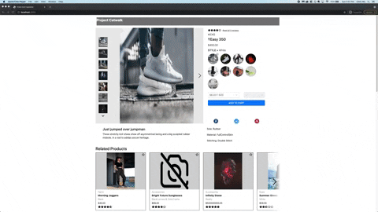

# Project Catwalk (Front End)

## Table of contents
1. Motivation
2. Technologies used
3. Usage

## Motivation
Project Catwalk is a retail e-commerce web app built by a team of 4 engineers and designed from a given set of business requirements.

The application consists of 4 sections: 
- **Product Detail (My contribution)**
- Ratings & Reviews
- Questions & Answers
- Related Items & Outfit Creation

